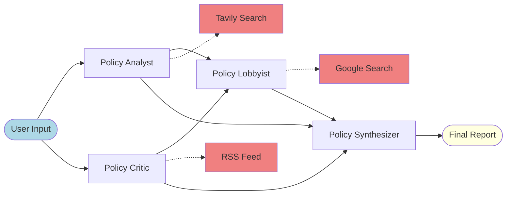
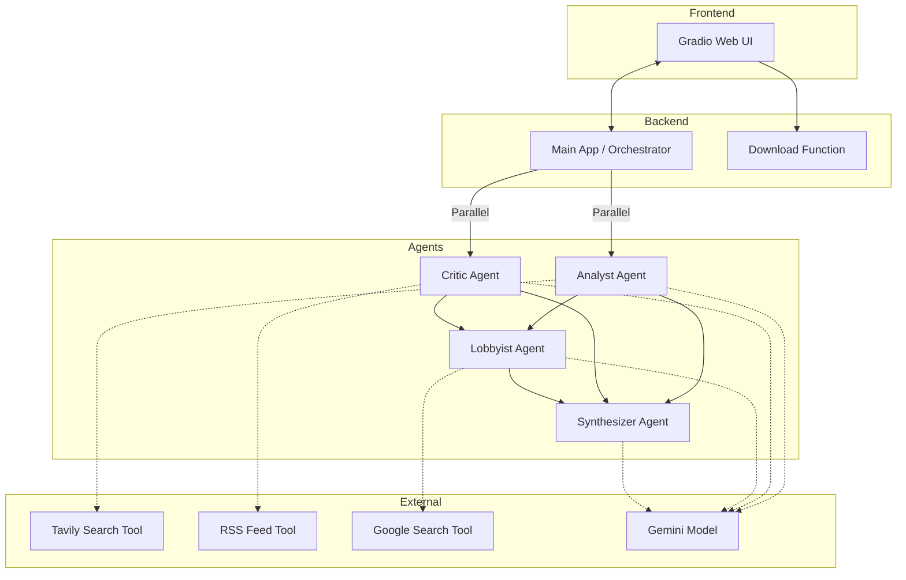

# Popu Agent - Data-Driven Policy Analyzer

This project contains the core logic for Popu Agent, a multi-agent system designed to assist users in analyzing public policies. The agent is built using Google Agent Development Kit (ADK) with the Gemini 2.5 Flash model and follows a modular architecture.

## Policy Analysis Architecture


The diagram above illustrates the end-to-end workflow of the Popu Agent system, showing how policy topics flow through the four specialized agents to produce comprehensive analysis.

## System Architecture


The system architecture diagram shows the relationship between the core components of the Popu Agent, including the Gradio UI, agent orchestrator, specialized agents, and external tools.

## Project Overview

Popu Agent is an intelligent policy analysis platform that leverages multiple specialized AI agents to research, critique, and propose future directives for public policies. It uses real-time data fetching to ensure all analysis is grounded in current facts and statistics.

### Problem Statement

Policy analysis is a complex and time-consuming process that requires significant expertise to evaluate the potential impacts of proposed legislation. Traditional policy analysis often lacks real-time data integration, leading to outdated or incomplete assessments. Manual policy evaluation struggles to scale when dealing with multiple policy domains simultaneously, forcing analysts to choose between breadth and depth of analysis. The repetitive nature of structuring policy reviews and maintaining consistent evaluation criteria across different policies can quickly become mentally exhausting and drain analytical resources.

### Solution Statement

Popu Agent automates policy analysis by gathering real-time information from multiple sources, synthesizing key insights, and identifying potential impacts. It generates comprehensive policy breakdowns based on real data, significantly reducing the time spent on initial policy evaluation. Additionally, Popu Agent can iteratively refine policy proposals based on feedback, manage the entire analysis workflow, and suggest improvements based on comparative policy data—transforming policy analysis from a manual chore into a streamlined, data-driven process.

### Architecture

Core to Popu Agent is the multi-agent system architecture—a prime example of collaborative AI. It's not a monolithic application but an ecosystem of specialized agents, each contributing to a different stage of the policy analysis process. This modular approach, facilitated by Google's Agent Development Kit, allows for a sophisticated and robust workflow.

The system orchestrates four specialized agents working in sequence:

#### 1. Policy Analyst Agent

This agent is responsible for researching and analyzing policy topics with real-world data. It uses the Tavily search tool to gather current statistics and information about the policy topic. The analyst structures its response with data-driven insights about the policy topic.

#### 2. Policy Critic Agent

This agent provides a critical review of the initial analysis, highlighting risks and potential flaws. It focuses on:
- Economic feasibility (with cited costs)
- Failed examples from other countries
- Direct negative impacts on specific groups

The critic also uses the Tavily search tool to find counter-evidence and failed policy examples.

#### 3. Policy Lobbyist Agent

This agent proposes three concrete future policy directives based on the analysis and critique. For each directive, it provides persuasive arguments backed by fresh data from the Google Search tool.

#### 4. Policy Synthesizer Agent

This agent creates an executive summary of the complete analysis process, including key data points, major risks, and future roadmap recommendations in a concise format. It does not use any external tools.

### Essential Tools and Utilities

The Popu Agent and its sub-agents are equipped with tools to perform their tasks effectively.

#### Real-Time Data Fetching ([fetch_policy_data](./tools.py))

This tool is crucial for generating fact-based policy analysis. It searches the web for real-time data, statistics, and news about policies using either the Tavily API or Google Search. The tool returns formatted search results with sources, ensuring all analysis is grounded in current facts.

#### Session Management

Popu Agent uses unique session IDs for each analysis run to ensure that conversations from previous runs don't interfere with new analyses. This provides clean context windows for each policy analysis task.

#### Report Export ([generate_markdown_report](./main.py))

Allows users to export the complete policy analysis as a downloadable Markdown file. The exported report includes all sections of the analysis (Analysis, Critique, Lobbyist, and Summary) along with metadata such as the policy topic and generation timestamp. Users can download the report using the "Download Report" button in the Gradio interface after completing an analysis.

### Conclusion

The beauty of Popu Agent lies in its iterative and collaborative workflow. Each specialized agent acts as an expert in its domain, contributing to a comprehensive policy analysis. The sequential coordination of these agents, powered by the Google ADK, results in a system that is modular, reusable, and scalable.

Popu Agent is a compelling demonstration of how multi-agent systems, built with powerful frameworks like Google's Agent Development Kit, can tackle complex, real-world problems. By breaking down the process of policy analysis into a series of manageable tasks and assigning them to specialized agents, it creates a workflow that is both efficient and robust.

### Value Statement

Popu Agent reduces policy analysis time by automating the research, critique, and recommendation phases of policy analysis. This enables policy researchers to produce more comprehensive evaluations at higher quality in less time.

## Installation

This project was built against Python 3.11+.

It is suggested you create a virtual environment using your preferred tooling e.g. uv.

Install dependencies: `pip install -r requirements.txt`

The required dependencies are:
- google-adk>=0.0.1
- google-generativeai>=0.3.0
- tavily-python>=0.3.0
- gradio>=4.0.0
- python-dotenv>=1.0.0

### API Keys Configuration

Before running the agent, you need to configure your API keys:

1. Create a `.env` file in the project root with your API keys:
   ```
   GOOGLE_API_KEY=your_google_api_key_here
   TAVILY_API_KEY=your_tavily_api_key_here
   ```

### Running the Agent

From the command line of the working directory, you can run the application in two ways:

**Method 1: Direct execution**
```bash
python main.py
```

**Method 2: Using the helper script**
```bash
python run_app.py
```

The application will launch a Gradio web interface that can be accessed in your browser.

## Project Structure

The project is organized as follows:

*   `main.py`: Defines the main application logic, orchestrates the multi-agent workflow, and provides the Gradio UI.
*   `tools.py`: Defines the custom tools used by the agents, particularly the Tavily search integration.
*   `config.py`: Contains the configuration for the application, such as API keys and default settings.
*   `setup_env.py`: Script to set up the virtual environment and install dependencies.
*   `run_app.py`: Helper script to run the application using the virtual environment.
*   `requirements.txt`: Lists the Python dependencies required for the project.
*   `generate_diagrams.py`: Script to generate architecture diagrams for documentation.
*   `images/`: Folder containing agent visualization diagrams:
    *   `Analytic.png`: Visualization of the Policy Analyst Agent
    *   `critic.png`: Visualization of the Policy Critic Agent
    *   `lobby.png`: Visualization of the Policy Lobbyist Agent
    *   `synth.png`: Visualization of the Policy Synthesizer Agent

## Workflow

The Popu Agent follows this workflow:

1.  **Policy Analysis:** The Analyst agent researches the given policy topic using real data fetched via Tavily Search
2.  **Critical Review:** The Critic agent examines the analysis for flaws and identifies risks
3.  **Future Planning:** The Lobbyist agent proposes actionable policy directives based on the analysis
4.  **Executive Summary:** The Synthesizer creates a concise summary for decision-makers

Each stage of the workflow is displayed in real-time in the Gradio interface, allowing users to monitor the progress and results of each specialized agent.

Users can export the complete analysis as a Markdown report using the "Download Report" button.

## Demo

This section showcases visualizations of the specialized agents that power the Popu Agent system:

### Policy Analyst Agent


### Policy Critic Agent


### Policy Lobbyist Agent


### Policy Synthesizer Agent
